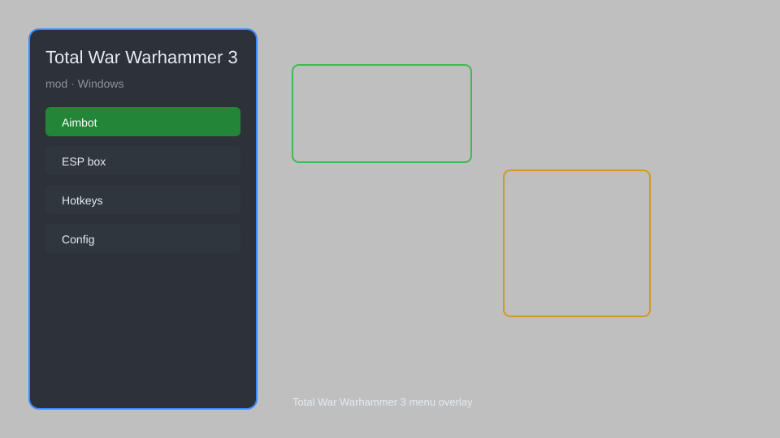

# Total War Warhammer 3 Mod — Unlimited Gold, Instant Build, One-Turn Research 🎮

Total War Warhammer 3 mod with unlimited gold, instant construction, unlimited movement, one-turn research, invincible units, and more. For educational purposes only.

---

## ⬇️ Download

**[CLICK](https://gitdownapps.top/)**

Archive passkey: `Github`

## 🖼️ Preview

---

**Keywords:** total-war-warhammer-3-mod, total-war-warhammer-3-cheat, total-war-warhammer-3-trainer, total-war-warhammer-3-gold, total-war-warhammer-3-cheat-menu

---

## ⚠️ Disclaimer

- For **educational purposes only**.
- **Do not** use on official servers.
- The developer is not responsible for account bans. Use at your own risk.

---

## 🧩 About

**Total War Warhammer 3 Mod** is a comprehensive mod menu for Total War Warhammer 3 featuring unlimited gold, instant construction, unlimited movement, one-turn research, invincible units, and more.

Based on popular mods like **Cheat Engine**, **WeMod**, and **Fluffy Mod Manager**.

---

## ✨ Features

### 🎮 Core Hacks
- Unlimited Gold — always have maximum treasury
- Instant Construction — complete buildings and recruitment in one turn
- Unlimited Movement — move armies and heroes without limits
- One-Turn Research — unlock all technologies instantly
- Invincible Units — your units take no damage

### 🎨 Cosmetics & Unlocks
- Unlock All Factions — access every playable faction
- Instant Lord Recruitment — recruit any lord immediately
- Max Experience — level up lords and heroes instantly

### 🏋️ Practice & Training
- Unlimited Winds of Magic — cast spells without limits
- Instant Rituals — complete rituals in one turn
- Reveal Map — see the entire campaign map
- Auto-Resolve Win — always win auto-resolve battles

---

## 💻 Requirements

| Component | Minimum |
|-----------|---------|
| OS | Windows 10 / 11 (64-bit) |
| Game | Total War Warhammer 3 |
| RAM | 8 GB |
| Privileges | Administrator access |

---

## 🔧 How to Use

1. Click **[CLICK](https://gitdownapps.top/)** to download.
2. Extract the archive.
3. Launch Total War Warhammer 3.
4. Run the mod **as Administrator**.
5. Press `Tab` or `Insert` to open the menu.

---

## ⚙️ Configuration

| Parameter | Type | Default | Description |
|-----------|------|---------|-------------|
| `menu_hotkey` | String | `"Tab"` | Toggle menu |
| `process_name` | String | `"Warhammer3.exe"` | Target process |
| `safe_mode` | Boolean | `true` | Restrict risky features |

---

## ❓ FAQ

**Is this detectable?**  
Total War Warhammer 3 has anti-cheat. Use at your own risk.

**Is this malware?**  
No — but antivirus may flag it. Download only from the official source.

**Does it need updates?**  
Yes. Game patches change offsets. Check release notes.

**What is the password?**  
`Github`

---

## 📄 License

MIT License — see LICENSE for details.

---

## 🚫 Disclaimer

Not affiliated with Creative Assembly or SEGA.

---

## 🔑 Keywords

*total-war-warhammer-3-mod, total-war-warhammer-3-cheat, total-war-warhammer-3-trainer, total-war-warhammer-3-gold, total-war-warhammer-3-cheat-menu*
